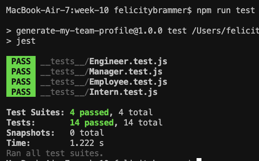

# Generate My Team Profile

## Description

Generate My Team Profile is a Node CLI that collects information about employees using the Inquirer package. An HTML page is generated using the information from the prompts to neatly organize and display the team profile.

An example team profile with manager, two engineers and two interns. Team sizes and compositon are not limited.  

## Installation

* run npm install from the command line
* add the following dependencies: jest for running tests and inquirer for collecting input
## User Input

The application will prompt the user with question to build an engineering team. A team consists of a manager amd any number of engineers and interns.

## Roster Output

The project generates an index.html page in the dist directory. 
Each team member will display the following:
* Name
* Role
* ID
* Email Address
* Role-specific property: office number, github username, or school
## Testing

To run a test, enter 'npm run test' for all test suites

Screenshot of all tests passing: 

